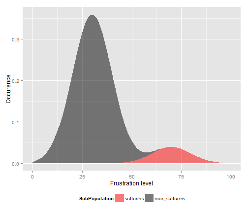

## The Mouse-itis model
A light-hearted model for experimenting with some features of R and some data-presentation packages; in particular:

 - Shiny - for a web-based presentation of the model
 - Slidify - for a brief presentation of the application

The model is based on two random variables: 
 - A binary random variable determining whether an individual is afflicted or not
 - A normal random variable generated with a mean that is higher for afflicted individuals 

---

## Probability model

The graph shows the probability of having a given level of frustration for sufferers and non-sufferers
for typical values of the affliction probability and the mean frustration levels.

 

---
 
## Predicting the condition
Two logistic regressions are performed on the data
 - The first assumes that only the level of frustration is known.
 
 ```r
 mdl <- formula(Afflicted ~ FrustrationLevel)
 glm(mdl, family=binomial(logit), data=sample_data)
 ```
 - The second assumes the existence of a test; this test has probabilities to result
   in false positive and false negative results.
 
 ```r
 mdl <- formula(Afflicted ~ FrustrationLevel + TestResult)
 glm(mdl, family=binomial(logit), data=sample_data)
 ```
 - Since this is only for illustration, no cross-validation or test data sets are used.


---

## Diagnosis

- The result of the logistic regression is a model which maps the frustration level and test result to a probability of affliction.

- By varying a probability threshold, the accuracy, precision and recall of the diagnosis can be varied.

- The aim of this application is to illustrate how the various factors (symptoms of affliction, a priori occurence of the condition, diagnosis threshold and test fidelity) interplay.


